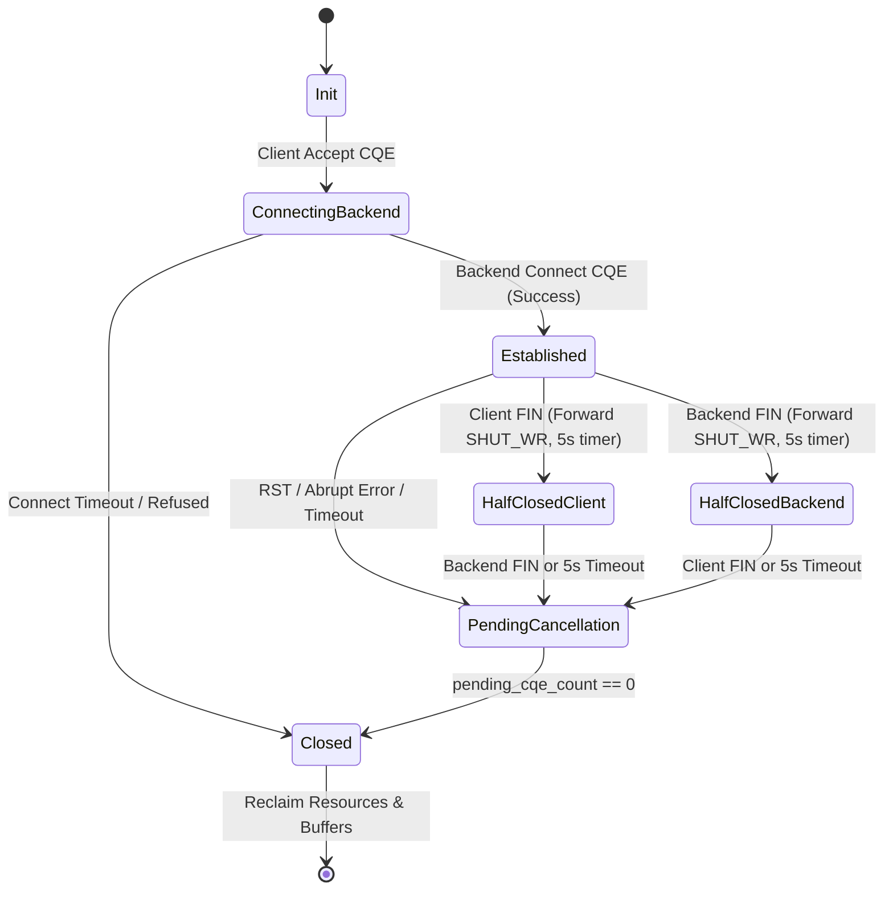

# Data Model & Domain Entities: Helios

**Feature Branch**: `001-helios-initial-spec`  
**Created**: 2026-09-19  
**Status**: Completed  

---

## 1. Overview

This document defines the key memory data structures, domain entities, state machines, and lifecycle invariants for the Helios Reverse Proxy & Load Balancer.

---

## 2. Core Entities & Memory Representations

### 2.1 Worker (`helios::Worker`)
An isolated execution context bound to a single physical CPU core.

```cpp
struct Worker {
    uint32_t worker_id;
    int cpu_affinity_core;
    struct io_uring ring;
    BufferPool buffer_pool;
    ConnectionMap connections;  // std::unordered_map<uint64_t, std::shared_ptr<ConnectionPair>>
    BackendPoolMap backend_pools;
    WorkerMetrics metrics;
    bool stopping{false};
};
```

- **Invariants**:
  - Exactly one `Worker` per CPU thread.
  - No hot-path memory shared between `Worker` instances.
  - Ring size (`ring_entries`) configured at startup (default: 4,096).

---

### 2.2 Buffer & BufferPool (`helios::BufferPool`)
Pre-allocated fixed-capacity memory allocator.

```cpp
struct Buffer {
    uint32_t buffer_id;
    uint8_t* data;
    size_t capacity;       // Default: 16,384 bytes (16 KB)
    size_t read_offset;
    size_t write_offset;
    uint32_t ref_count;
};

class BufferPool {
    std::vector<uint8_t> contiguous_memory_block_;
    std::vector<Buffer> buffers_;
    std::vector<uint32_t> free_stack_;
    size_t checked_out_count_{0};
    size_t total_buffers_{0};
    
public:
    Buffer* Acquire();
    void Release(Buffer* buf);
    double UtilizationRatio() const; // checked_out_count_ / total_buffers_
};
```

- **Invariants**:
  - Zero heap allocation during `Acquire()` / `Release()`.
  - Watermark backpressure: High watermark = 100% (pause reads/accepts), Low watermark = 80% (resume reads/accepts).

---

### 2.3 OpContext (`helios::OpContext`)
Operation metadata tagged in `io_uring` `user_data` field (`SQE.user_data`).

```enum
enum class OpType : uint8_t {
    Accept,
    Connect,
    ClientRead,
    ClientWrite,
    BackendRead,
    BackendWrite,
    Timeout,
    Shutdown
};

struct OpContext {
    OpType op_type;
    int fd;
    Buffer* buffer;
    std::weak_ptr<ConnectionPair> conn_pair;
    uint64_t sequence_id;
};
```

- **Invariants**:
  - Must remain valid in memory until kernel returns corresponding CQE.
  - Pointer to `OpContext` encoded directly in 64-bit `SQE.user_data`.

---

### 2.4 ConnectionPair (`helios::ConnectionPair`)
State machine managing a client TCP socket and its paired upstream backend socket.

```cpp
enum class ConnState : uint8_t {
    Init,
    ConnectingBackend,
    Established,
    HalfClosedClient,    // Client sent FIN
    HalfClosedBackend,   // Backend sent FIN
    PendingCancellation, // Closing, waiting for outstanding CQEs to hit 0
    Closed
};

struct ConnectionPair {
    uint64_t conn_id;
    int client_fd;
    int backend_fd;
    ConnState state{ConnState::Init};
    
    // In-flight operation reference counting
    uint32_t pending_cqe_count{0};
    
    // Ring buffer queues
    RingBuffer client_to_backend_buf;
    RingBuffer backend_to_client_buf;
    
    // State flags & timers
    bool client_read_paused{false};
    bool backend_read_paused{false};
    uint64_t last_active_timestamp_ms;
    uint64_t half_close_start_ms{0};
};
```

#### Connection State Machine Transitions



---

### 2.5 BackendPool & BackendEndpoint (`helios::BackendEndpoint`)
Upstream destination management and health tracking.

```cpp
enum class HealthState : uint8_t {
    Healthy,
    Degraded,
    Unhealthy
};

struct BackendEndpoint {
    std::string ip_address;
    uint16_t port;
    uint32_t weight{1};
    
    // Dynamic operational state
    std::atomic<uint32_t> active_connections{0};
    HealthState health_state{HealthState::Healthy};
    uint32_t consecutive_failures{0};
    uint64_t next_probe_timestamp_ms{0};
    
    // Latency tracking
    uint64_t total_requests{0};
    uint64_t total_errors{0};
};

class BackendPool {
    std::vector<BackendEndpoint> endpoints_;
    LoadBalancingAlgorithm algorithm_{LoadBalancingAlgorithm::RoundRobin};
    uint32_t rr_index_{0};
    
public:
    BackendEndpoint* SelectBackend(const ClientRequest& req);
    void ReportResult(BackendEndpoint* endpoint, bool success, uint64_t rtt_us);
};
```

---

### 2.6 HttpParserContext (`helios::HttpParserContext`)
Zero-copy L7 HTTP/1.1 parsing context.

```cpp
enum class HttpParseState {
    ParsingHeaders,
    ParsingBody,
    Complete,
    ErrorMalformed,
    ErrorSmugglingDetected
};

struct HttpHeader {
    std::string_view name;
    std::string_view value;
};

struct HttpParserContext {
    HttpParseState state{HttpParseState::ParsingHeaders};
    std::string_view method;
    std::string_view uri;
    int http_major{1};
    int http_minor{1};
    
    std::vector<HttpHeader> headers;
    size_t content_length{0};
    bool is_chunked{false};
    bool keep_alive{true};
    size_t header_bytes_parsed{0};
    size_t body_bytes_read{0};
};
```
