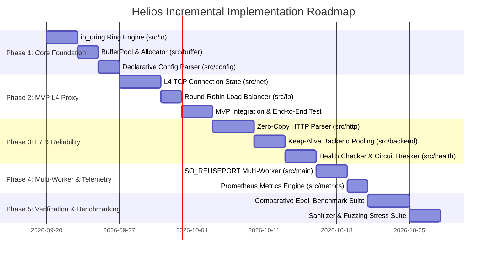

# Implementation Plan: Helios Core Reverse Proxy & Load Balancer

**Branch**: `001-helios-initial-spec` | **Date**: 2026-09-19 | **Spec**: [spec.md](file:///home/mayukh/projects/helios/specs/001-helios-initial-spec/spec.md)

**Input**: Finalized feature specification from `specs/001-helios-initial-spec/spec.md` and research findings from `specs/001-helios-initial-spec/research.md`.

---

## Executive Summary

Helios is designed as a Linux-native, high-performance L4/L7 reverse proxy and load balancer implemented in modern C++ (C++20/C++23) built directly around `io_uring`. The implementation follows a strict **thread-per-core, shared-nothing architecture** to eliminate lock contention and dynamic allocations on the network hot path.

This plan details the incremental module decomposition, `io_uring` operation lifecycles, memory buffer mechanics, state machines, reliability semantics, testing gates, and hypothesis-driven benchmark methodology.

---

## Technical Context

- **Language/Version**: C++20 / C++23 (Clang 13+ / GCC 11+) compiled with `-Wall -Wextra -Werror -Wpedantic`
- **Primary Dependencies**: Linux kernel 5.19+, `liburing` (v2.2+), GoogleTest, Google Benchmark, CMake
- **Storage**: N/A (Memory-only runtime, declarative YAML/JSON configuration files)
- **Testing**: GoogleTest (unit/integration), libFuzzer / AFL++ (fuzzing), wrk / wrk2 / Vegeta (benchmarking), ASan, UBSan, TSan
- **Target Platform**: Linux x86_64 / ARM64
- **Project Type**: Native High-Performance Systems Reverse Proxy / Load Balancer
- **Performance Targets**: 200,000+ QPS per node, added p99 proxy latency < 300 µs (hypotheses to be measured)
- **Constraints**: Bounded memory footprint, zero hot-path heap allocations, reference-counted deferred operation cleanup, 0 sanitizer errors

---

## Constitution Check

All design decisions in this plan strictly comply with the **Helios Constitution**:

- **I. Correctness & Compliance**: Strict RFC 9110/9112 HTTP parsing; explicit state machines; immediate rejection of ambiguous headers (`Content-Length` + `Transfer-Encoding`).
- **II. Measured Performance**: All performance assertions treated as hypotheses; includes parallel 1:1 `epoll` baseline for comparative benchmarking.
- **III. Explicit Asynchronous Ownership**: `user_data` tags reference-counted `OpContext`; resources retained until pending CQE count reaches 0.
- **IV. Backpressure & Bounded Resources**: Pre-allocated fixed `BufferPool` with 100% pause / 80% resume watermark policy; zero hot-path dynamic memory.
- **V. Testable Concurrency**: Thread-per-core / shared-nothing execution; zero hot-path mutexes or shared atomic variables.
- **VI. Failure Containment**: Per-connection fault isolation; circuit breaking with exponential backoff; timeout-bounded TCP half-close (5s).
- **VII. Linux-Native Engineering**: Direct `io_uring` and `liburing` integration; no general-purpose event-loop abstractions (Boost.Asio/libuv prohibited).
- **IX. Honest Zero-Copy**: Data path copies explicitly quantified; zero-copy claims backed by byte-tracing measurements.
- **XV. Production-Like Engineering**: Declarative config validation, active/passive health checks, Prometheus `/metrics`, graceful 15s connection draining.

---

## Project & Repository Structure

The codebase is organized into modular, isolated C++ components under `src/` and dedicated testing/benchmarking directories:

```text
helios/
├── CMakeLists.txt
├── config/
│   ├── helios_mvp.yaml
│   └── helios_production.yaml
├── docs/
│   ├── architecture.md
│   └── adr/
├── src/
│   ├── main.cpp
│   ├── io/                  # io_uring abstraction, Ring, SQE/CQE dispatch
│   ├── net/                 # Socket wrappers, ConnectionPair, ConnectionMap
│   ├── buffer/              # BufferPool, Buffer, FixedBufferRing
│   ├── http/                # L7 HTTP/1.1 zero-copy parser & smuggling checks
│   ├── lb/                  # Load balancing algorithms (RR, WRR, LeastConn, Ketama)
│   ├── backend/             # BackendPool, BackendEndpoint lifecycle
│   ├── health/              # Active TCP/HTTP probes & CircuitBreaker
│   ├── config/              # Declarative YAML config parser & validator
│   └── metrics/             # Thread-local metrics collector & Prometheus server
├── tests/
│   ├── unit/                # Unit tests for buffer, parser, LB algorithms
│   ├── integration/         # End-to-end L4/L7 proxying & failover tests
│   └── benchmarks/          # Google Benchmark & comparative epoll baseline
├── fuzz/                    # libFuzzer HTTP parser test targets
└── specs/
    └── 001-helios-initial-spec/
        ├── spec.md
        ├── plan.md
        ├── research.md
        ├── data-model.md
        ├── quickstart.md
        ├── contracts/
        │   ├── config-schema.md
        │   └── metrics-schema.md
        └── checklists/
            └── requirements.md
```

---

## Comprehensive Module Architecture Specifications

### 1. `src/io` — `io_uring` Ring Core Engine

- **Responsibility**: Manages kernel `io_uring` instance initialization, SQE submission batching, CQE event reaping, user-data encoding, and operation cancellation.
- **Dependencies**: `liburing`, Linux kernel syscalls.
- **Important Interfaces**:
  ```cpp
  class RingEngine {
  public:
      explicit RingEngine(uint32_t entries, uint32_t flags = 0);
      ~RingEngine();
      
      bool PrepRead(int fd, Buffer* buf, OpContext* ctx);
      bool PrepWrite(int fd, Buffer* buf, size_t len, OpContext* ctx);
      bool PrepAccept(int listener_fd, OpContext* ctx);
      bool PrepConnect(int fd, const sockaddr* addr, socklen_t len, OpContext* ctx);
      bool PrepCancel(OpContext* target_ctx, OpContext* cancel_ctx);
      
      uint32_t SubmitAndReap(uint32_t min_complete, std::span<struct io_uring_cqe*> cqe_out);
  };
  ```
- **Ownership Model**: Owned exclusively by a single `Worker` thread.
- **Concurrency Model**: Single-threaded (no internal locks).
- **Failure Modes**: Kernel ring overflow (`EBUSY`/`ENOMEM`) triggers user-space SQE fallback queuing; missing kernel features abort startup.
- **Tests Required**: Ring init/cleanup tests, SQE submission overflow unit tests, operation cancellation tests.

---

### 2. `src/buffer` — Bounded Memory Buffer Management

- **Responsibility**: Pre-allocates contiguous memory blocks, manages checkout/checkin stacks, tracks buffer reference counts, and computes pool utilization watermarks.
- **Dependencies**: Standard C++ memory headers (`<vector>`, `<span >`).
- **Important Interfaces**:
  ```cpp
  class BufferPool {
  public:
      BufferPool(size_t total_blocks, size_t block_size_bytes);
      Buffer* Acquire();
      void Release(Buffer* buf);
      double UtilizationRatio() const;
      bool IsExhausted() const;
  };
  ```
- **Ownership Model**: Owned 1:1 by a single `Worker`. Buffers are checked out by `ConnectionPair` and returned upon CQE completion.
- **Concurrency Model**: Strictly single-threaded (no cross-thread buffer sharing).
- **Failure Modes**: 100% pool exhaustion triggers read/accept SQE pause; resume occurs when utilization drops below 80%.
- **Tests Required**: Buffer acquisition/release stress tests, zero-allocation enforcement tests, watermark trigger unit tests.

---

### 3. `src/net` — Connection State Machine & L4 Proxying

- **Responsibility**: Manages client/backend socket descriptors, tracks `pending_cqe_count`, executes state transitions, enforces bi-directional forwarding, backpressure, and timeout-bounded half-close.
- **Dependencies**: `src/io`, `src/buffer`, `src/lb`.
- **Important Interfaces**:
  ```cpp
  class ConnectionPair : public std::enable_shared_from_this<ConnectionPair> {
  public:
      void OnClientReadComplete(int res, Buffer* buf);
      void OnBackendWriteComplete(int res, Buffer* buf);
      void OnBackendReadComplete(int res, Buffer* buf);
      void OnClientWriteComplete(int res, Buffer* buf);
      void HandleHalfClose(bool from_client);
      void InitiateClose(const char* reason);
  };
  ```
- **Ownership Model**: Managed via `std::shared_ptr<ConnectionPair>` inside worker `ConnectionMap`.
- **Concurrency Model**: Worker-isolated state machine.
- **Failure Modes**: Socket disconnects, TCP resets, or timeouts transition state to `Pending-Cancellation`; resources reclaimed only when `pending_cqe_count == 0`.
- **Tests Required**: Bi-directional L4 forwarding correctness, partial read/write resubmission tests, timeout-bounded half-close (5s) tests, client/backend race condition tests.

---

### 4. `src/http` — L7 HTTP/1.1 Zero-Copy Streaming Parser

- **Responsibility**: Incremental HTTP/1.1 request/response header and chunked body parsing, header field extraction, and strict request smuggling validation.
- **Dependencies**: Standard string views (`<string_view>`).
- **Important Interfaces**:
  ```cpp
  class HttpParser {
  public:
      HttpParseResult ParseRequest(std::string_view raw_bytes, HttpParserContext& ctx);
      static bool ValidateFramingHeaders(const HttpParserContext& ctx);
  };
  ```
- **Ownership Model**: Embedded inside `ConnectionPair` for L7 sessions.
- **Concurrency Model**: Single-threaded stateless evaluation over buffer slices.
- **Failure Modes**: Malformed headers or conflicting `Content-Length`/`Transfer-Encoding` return `ErrorSmugglingDetected` -> HTTP 400 response.
- **Tests Required**: Unit tests for valid/invalid HTTP vectors, RFC 9112 smuggling compliance tests, libFuzzer fuzzing targets.

---

### 5. `src/lb` & `src/backend` — Load Balancing & Backend Management

- **Responsibility**: Maintains active backend endpoints, executes load-balancing policies (Round Robin, Weighted RR, Least Connections, Consistent Hashing), and tracks active connection counts.
- **Dependencies**: `src/health`.
- **Important Interfaces**:
  ```cpp
  class ILoadBalancer {
  public:
      virtual BackendEndpoint* SelectBackend(const ClientRequest* req) = 0;
  };
  ```
- **Ownership Model**: Read-heavy configuration shared per pool across worker thread-local copies.
- **Concurrency Model**: Worker-local endpoint selection.
- **Failure Modes**: All backends unhealthy triggers HTTP 502 Bad Gateway / TCP connection rejection.
- **Tests Required**: Round-robin distribution unit tests, weighted distribution statistical tests, least-connection selection correctness tests, Ketama hash ring consistency tests.

---

### 6. `src/health` — Health Checking & Circuit Breaking

- **Responsibility**: Performs active background TCP/HTTP probes against backends; tracks passive connection/response failures to drive Circuit Breaker states (Closed, Open, Half-Open) with exponential backoff.
- **Dependencies**: `src/io`, `src/backend`.
- **Important Interfaces**:
  ```cpp
  class CircuitBreaker {
  public:
      bool AllowRequest();
      void ReportSuccess();
      void ReportFailure();
      CircuitState GetState() const;
  };
  ```
- **Ownership Model**: Owned per `BackendEndpoint`.
- **Concurrency Model**: Worker-local or lockless atomic health status updates.
- **Failure Modes**: Flapping backends trigger exponential backoff suppression.
- **Tests Required**: Active probe timeout unit tests, circuit state transition tests (Closed -> Open -> Half-Open -> Closed), backoff calculation tests.

---

### 7. `src/config` & `src/metrics` — Configuration & Observability

- **Responsibility**: Loads and validates declarative YAML configuration files; collects thread-local operational metrics and exposes a Prometheus `/metrics` endpoint.
- **Dependencies**: Standard library, YAML parser library (`yaml-cpp`).
- **Important Interfaces**:
  ```cpp
  class ConfigLoader {
  public:
      static ConfigResult LoadFromFile(const std::string& path);
  };
  
  class MetricsCollector {
  public:
      void RecordRequest(uint64_t rtt_us);
      void RecordBytesRead(size_t bytes);
      std::string RenderPrometheusText() const;
  };
  ```
- **Ownership Model**: Config loaded at startup; metrics collected thread-locally per worker.
- **Concurrency Model**: Lockless thread-local metric counters scraped by background metrics server.
- **Failure Modes**: Invalid config fields fail startup validation with clear line errors.
- **Tests Required**: Config schema validation tests, Prometheus text rendering compliance tests.

---

## Incremental Building Strategy & Implementation Phases



---

## Experimental & Research Isolation Plan

In accordance with Principle II (Measured Performance) and Principle VIII (Incremental Complexity), all advanced or speculative kernel features are kept isolated from the core stable path:

1. **SQPOLL Kernel Polling (`IORING_SETUP_SQPOLL`)**: Enabled via config flag `experimental.sqpoll: true`. Evaluated strictly in `tests/benchmarks/` to measure QPS vs idle CPU core utilization.
2. **Fixed Buffer Registration (`IORING_REGISTER_BUFFERS`)**: Enabled via `experimental.registered_buffers: true`. Measures page-table lookup reduction using `perf stat`.
3. **Multishot Ring Provided Buffers (`IORING_OP_PROVIDE_BUFFERS`)**: Evaluated as an alternative allocation backend in `src/buffer/provided_buffer_ring.cpp`.
4. **Zero-Copy Kernel Forwarding (`splice` / `MSG_ZEROCOPY`)**: Evaluated in L4 benchmarking suite across small (512B) vs large (1MB) payload sizes to measure throughput threshold benefits.

---

## Verification & Quality Gates

Before merging any component into the primary branch, the following verification gates MUST pass cleanly:

1. **Sanitizer Gate**: `make test` completes cleanly under AddressSanitizer (ASan), UndefinedBehaviorSanitizer (UBSan), and ThreadSanitizer (TSan).
2. **Fuzzing Gate**: `libFuzzer` HTTP parser target executes 100,000 iterations without crash or memory leak.
3. **Protocol Conformance Gate**: Passes 100% of HTTP/1.1 framing test vectors and smuggling attack suites.
4. **Benchmarking Gate**: No regression in L4/L7 throughput compared to previous baseline release.
